## Minute Launcher: A Minimalist Digital Wellbeing Launcher

Minute Launcher is a free and open-source launcher designed to promote mindful phone usage. Experience a minimalist interface focused on essential functions and digital well-being.

### Key Features
* **Minimalist design:** Enjoy a clean and distraction-free home screen with easy access to your essential apps.
* **Intuitive gestures:** Quickly access notifications, the app drawer, and four custom shortcuts with simple swipes.
* **Usage insights:** Stay informed about your phone usage with clear and informative usage statistics - directly in your launcher.
* **Material You integration:** Enjoy a cohesive look and feel that adapts to your wallpaper.

  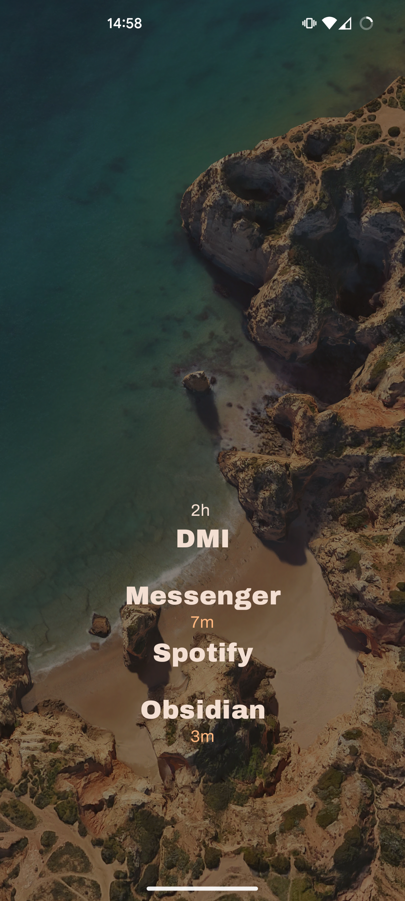
  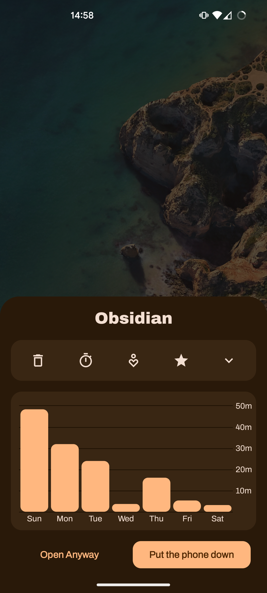
  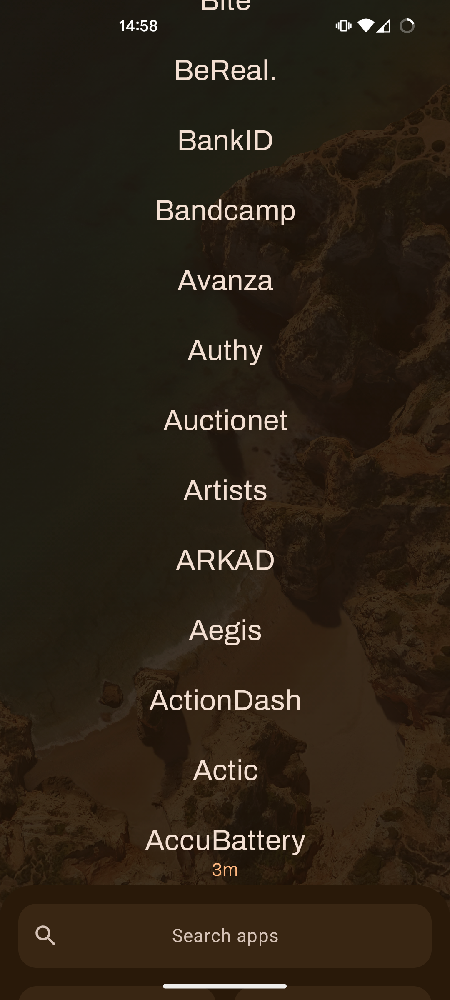
  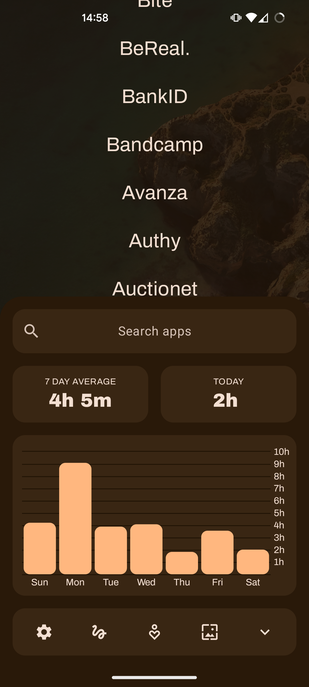

  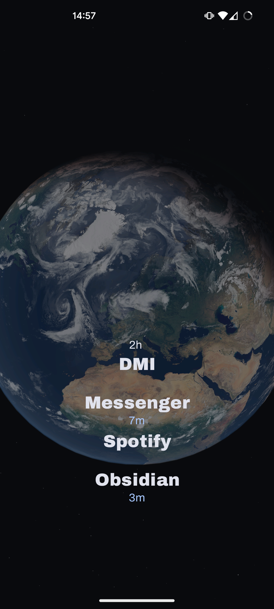
  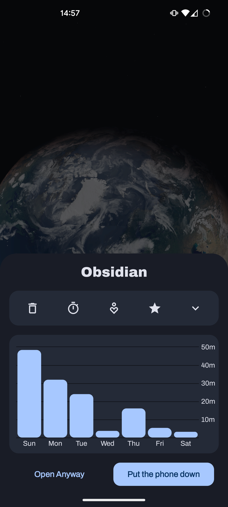
  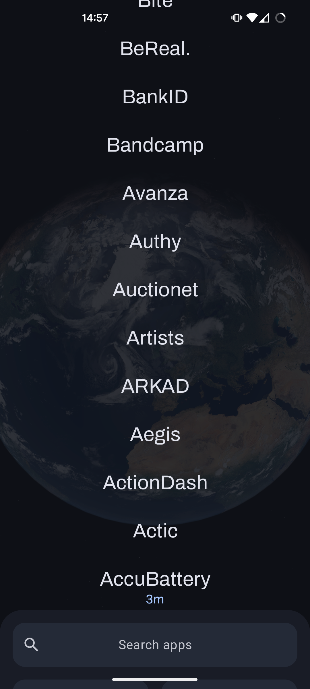
  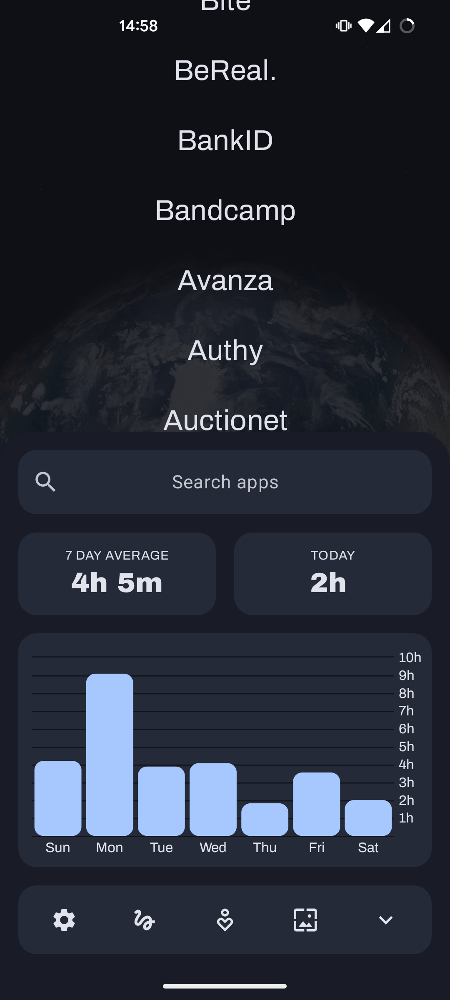

  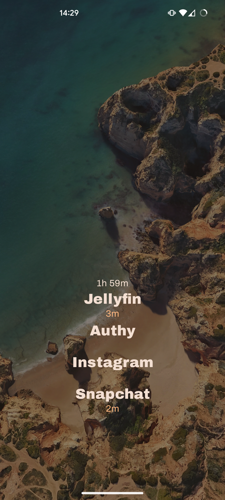
  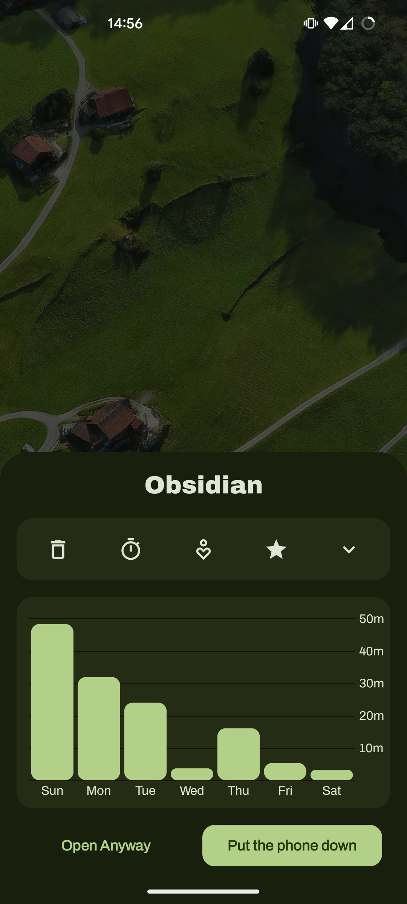
  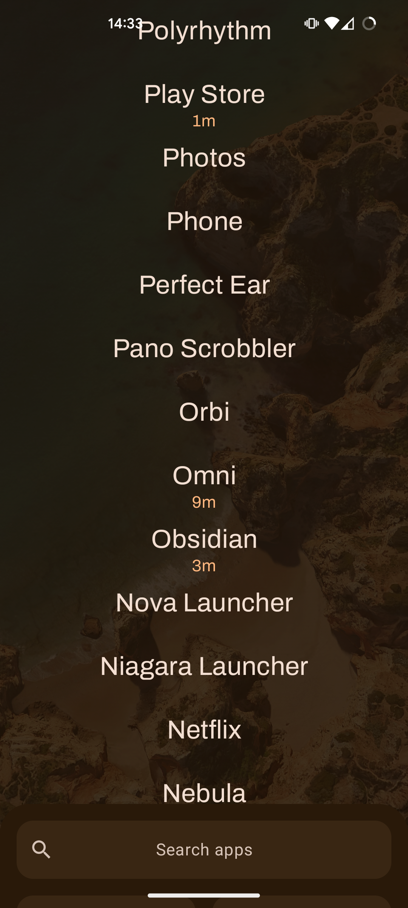
  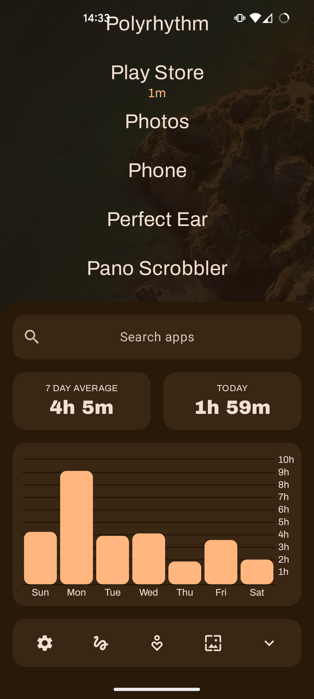

### How it Works
Minute Launcher offers a streamlined experience focused on mindful phone usage. Usage statistics are prominently displayed on your homescreen to give you conscious awareness of screen time, while the integrated countdown timer helps you resist impulsive app opening and encourages more intentional phone usage.

### Getting Started
The launcher is still in development, if you're eager to try it out there will be some releases here on Github under the releases-tab. 

### Contributing
Contributions are welcome! The project is completely open source, so if you'd like to get involved you can easily fork it and make any changes you want, and then submit a pull request. 

### Contact
For feedback, questions, or bug reports, please open a new issue or discussion thread here on Github. 

