## Minute Launcher: A Minimalist Digital Wellbeing Launcher

Minute Launcher is a free and open-source launcher designed to promote mindful phone usage. 

I was not satisfied with any of the minimal launchers available on the play store, and set out to create a launcher that does exactly what I need it to do - and nothing else. Usage statistics are prominently displayed on the homescreen to give you conscious awareness of screen time, while the countdown timer encourages more intentional phone usage by preventing you from mindlessly opening apps.

### Key Features
* *Minimalist design*: A distraction free homescreen, with quick and easy access to the apps you need the most.
* *Usage statistics*: Your app usage statistics is integrated into your homescreen, giving you .
* *Mindful Delay*: Add a customizable delay before apps open, giving you a moment to reconsider, and helping you stay intentional,.
* *Gesture Shortcuts*: Intuitive gestures to access notifications, the app darwer, and four custom app shortcuts.
* *Material You integration*: Colors automatically match your wallpaper and the rest of your system.

  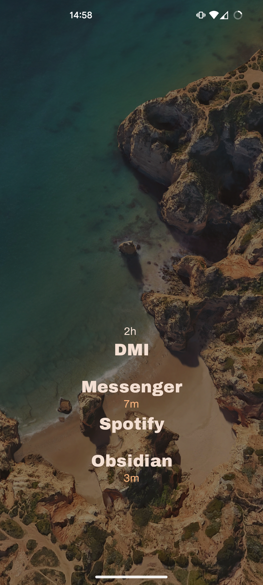
  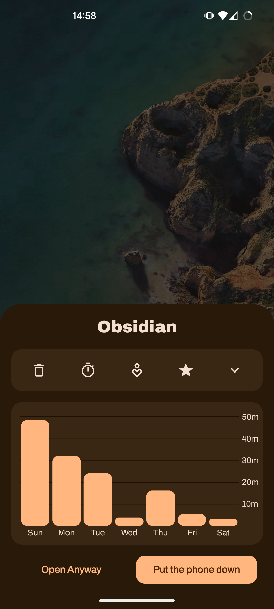
  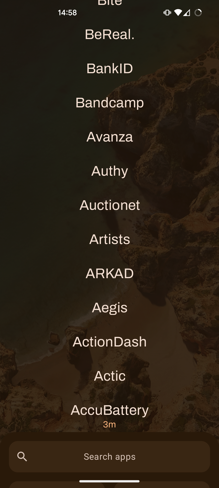
  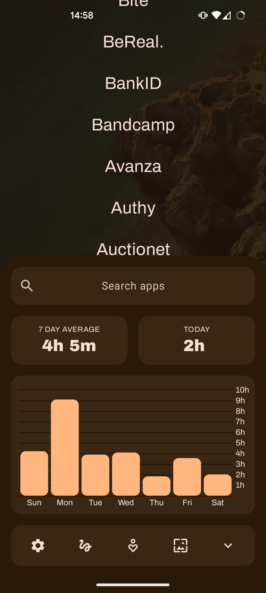

  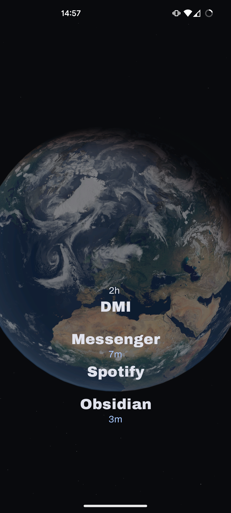
  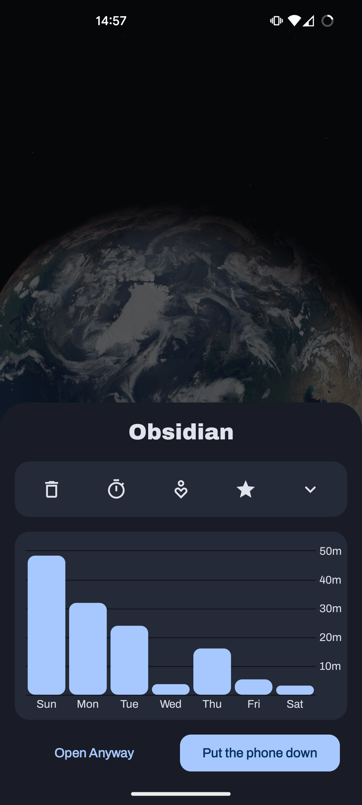
  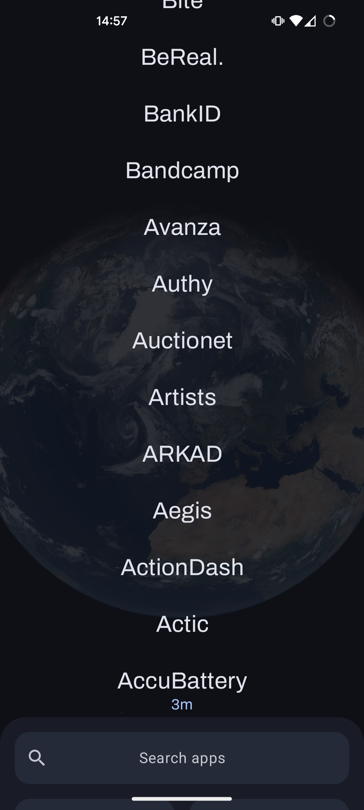
  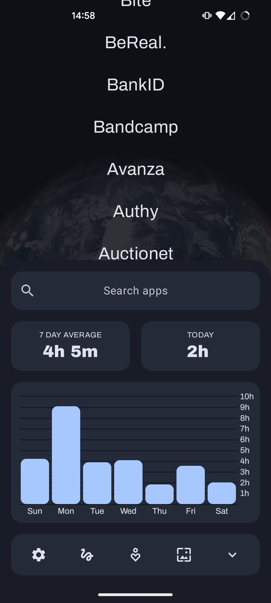

  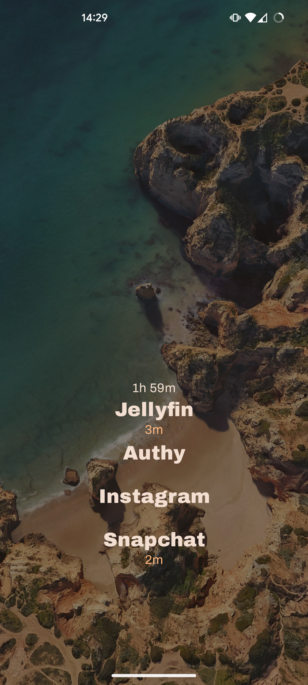
  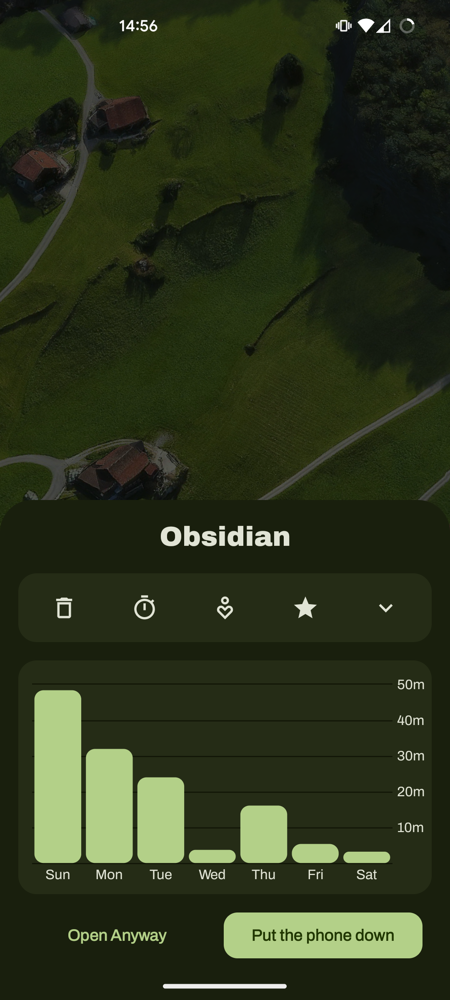
  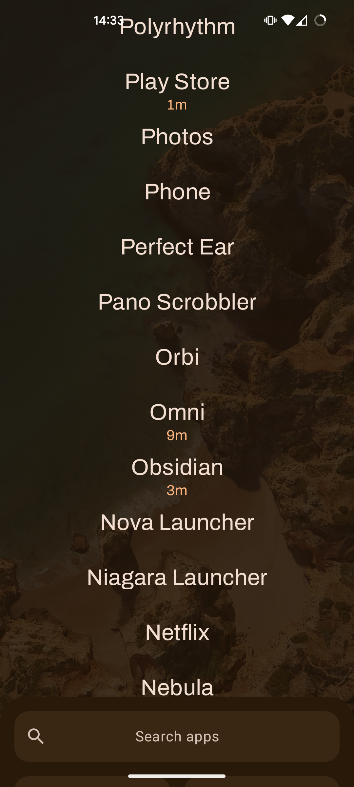
  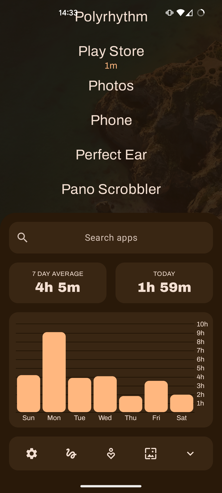

### Getting Started
The launcher is still in development, if you're eager to try it out there will be some releases here on Github under the releases-tab. 

### Contributing
Contributions are welcome! The project is completely open source, so if you'd like to get involved you can easily fork it and make any changes you want, and then submit a pull request. 

### Contact
For feedback, questions, or bug reports, please open a new issue or discussion thread here on Github. 

